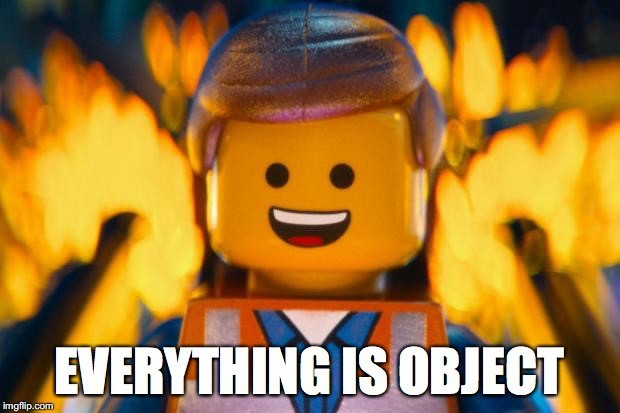

# Python - Every thing is object



## Introduction

In Python, you are working with numbers, strings, or complex data structures like lists and dictionaries, you are always dealing with objects. Understanding how Python handles objects is essential for writing correct and efficient code, especially when it comes to identity, mutability, and function arguments.

## Identity and Type

Every object in Python has three main characteristics: a **value**, a **type**, and an **identity**. The identity of an object can be thought of as its location in memory and can be obtained using the `id()` function. The type of an object is retrieved using the `type()` function.

```python
a = [1, 2, 3]
print(type(a))  # <class 'list'>
print(id(a))    # memory address (example: 139926795932424)
```

Two variables can refer to the same object, which means they share the same identity:

```python
l1 = [1, 2, 3]
l2 = l1

print(l1 is l2)  # True (same object)
print(l1 == l2)  # True (same value)
```

However, two objects can have the same value but different identities:

```python
l1 = [1, 2, 3]
l2 = [1, 2, 3]

print(l1 is l2)  # False
print(l1 == l2)  # True
```

## Mutable Objects

Mutable objects are objects whose content can be modified after creation without changing their identity. Common mutable types include lists, dictionaries, and sets.

```python
l = [1, 2, 3]
print(id(l))

l.append(4)
print(l)        # [1, 2, 3, 4]
print(id(l))    # same id as before
```

Because mutable objects can be modified in place, multiple variables referencing the same object will all see the change:

```python
l1 = [1, 2, 3]
l2 = l1

l1.append(4)
print(l2)  # [1, 2, 3, 4]
```

This behavior is known as **aliasing**.

## Immutable Objects

Immutable objects cannot be modified after they are created. Instead, any operation that seems to modify them actually creates a new object. Common immutable types include integers, floats, strings, and tuples.

```python
a = 5
print(id(a))

a = a + 1
print(a)        # 6
print(id(a))    # different id
```

Even though it looks like `a` is modified, Python actually creates a new integer object and reassigns `a` to it.

Tuples are also immutable, but they can contain mutable elements:

```python
t = ([1, 2], [3, 4])
t[0].append(5)

print(t)  # ([1, 2, 5], [3, 4])
```

The tuple itself is immutable, but the list inside it is mutable.

## Why This Matters and How Python Treats Them Differently

Understanding the difference between mutable and immutable objects is crucial because Python treats them differently in memory and operations. Mutable objects can be changed in place, which can lead to unintended side effects when multiple variables reference the same object. Immutable objects, on the other hand, are safer in this regard because any change creates a new object.

For example:

```python
l1 = [1, 2, 3]
l2 = l1
l1 = l1 + [4]

print(l2)  # [1, 2, 3]
```

Here, `l1 + [4]` creates a new list, so `l2` is unaffected.

But:

```python
l1 = [1, 2, 3]
l2 = l1
l1 += [4]

print(l2)  # [1, 2, 3, 4]
```

In this case, `+=` modifies the list in place, affecting both variables.

## How Arguments Are Passed to Functions

Python uses a model often described as **“pass by object reference”**. This means that functions receive references to objects, not copies. The behavior depends on whether the object is mutable or immutable.

### With Immutable Objects

```python
def increment(n):
    n += 1

a = 1
increment(a)
print(a)  # 1
```

Here, `n += 1` creates a new object inside the function, leaving `a` unchanged.

### With Mutable Objects

```python
def add_item(lst):
    lst.append(4)

l = [1, 2, 3]
add_item(l)
print(l)  # [1, 2, 3, 4]
```

The list is modified in place, so the change is visible outside the function.

### Reassignment Inside Functions

```python
def assign_value(n, v):
    n = v

l1 = [1, 2, 3]
l2 = [4, 5, 6]
assign_value(l1, l2)

print(l1)  # [1, 2, 3]
```

Reassigning `n` does not affect `l1` because it only changes the local reference.

---

Understanding these concepts—identity, mutability, and how Python passes arguments—is essential for avoiding bugs and writing predictable code. Mastering them allows you to clearly reason about how your programs behave, especially when dealing with complex data structures.

## Sources

- [Think Python - Objects and Values](https://www.openbookproject.net/thinkcs/python/english2e/ch09.html#objects-and-values)
- [Think Python - Aliasing](https://www.openbookproject.net/thinkcs/python/english2e/ch09.html#aliasing)
- [Composing Programs - Mutable Data](https://www.composingprograms.com/pages/24-mutable-data.html#sequence-objects)
